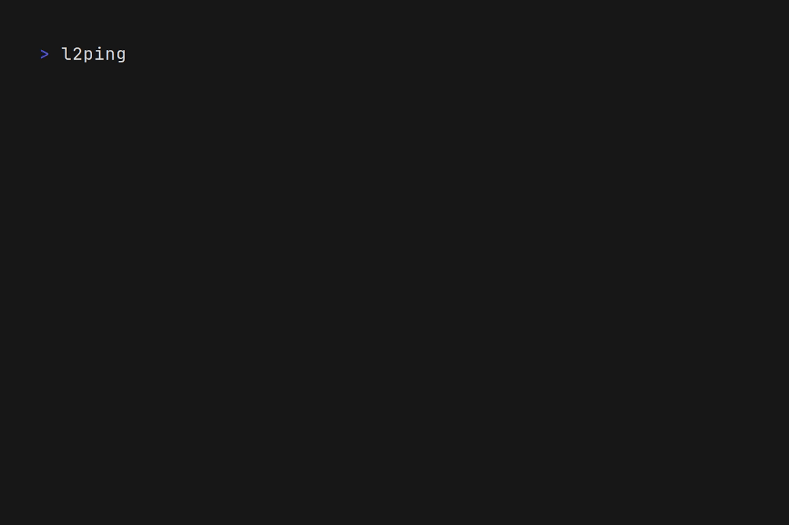

# `left`: See what's left, live what's right.
*Inspired by [@CristianRus4](https://x.com/CristianRus4)'s [Left](https://www.cristianrus.me/apps/left). Take a look at his awesome app!*

`left` is a lightweight, terminal-based progress tracker that provides an intuitive visualization of elapsed and remaining time. It offers a simple yet powerful way to stay aware of time.



## Usage
```
left -m (life|year|month|day) [-b birthdate] [-h]
  -m  Mode: life, year, month, or day (default: year)
  -b  Birthdate in yyyy-mm-dd format (required for life mode)
  -q  Quiet mode (only show progress bar)
  -h  Show this help message
```

## Installation
To install `left` for the current user:
```
git clone https://github.com/bernas670/left.git && \
chmod +x left/left.sh && \
mkdir -p ~/.local/bin && \
mv left/left.sh ~/.local/bin/left && \
rm -rf left
```
Note: Make sure that `~/.local/bin` is in your `PATH`.

## Contributing
Contributions are welcome! If you have suggestions for improving the script or find a bug, feel free to open an issue or submit a pull request.